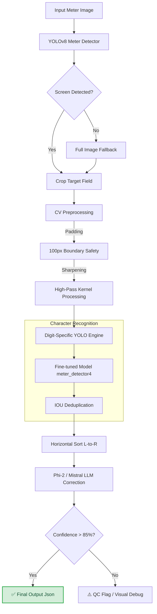

# Instinct GPT OCR (Anti-Gravity Pipeline)

[](https://universe.roboflow.com/deephikas-workspace/meter-reading-tdkan-nonzv)

## 🚀 Optimized YOLOv8s ML Pipeline
This repository features a custom-trained **YOLOv8s** (Small) model, optimized for high-precision digital meter reading and segment-level character recognition.

### Performance Highlights:
- **Architecture:** YOLOv8s (Small) trained for **200 Epochs** on 619 images.
- **Accuracy:** mAP50 = **0.963** for digit/decimal detection.
- **Stability:** High-resolution inference (up to 1024px) for capturing thin segments like the leading '1'.
- **Cloud Optimized:** Lean dependency tree for **Streamlit Cloud** (Fast boot, BGR-to-RGB robustness).
- **Architecture:** Transitioned from generic OCR to a **Digit-First YOLO Ensemble** with LLM correction.

### 📟 Launching the Streamlit App
1. Install dependencies: `pip install -r requirements.txt`
2. Run the dashboard: `streamlit run streamlit_app.py`
3. **Streamlit Cloud**: Simply push to `main` and the app auto-deploys via [share.streamlit.io](https://share.streamlit.io).

### ⚙️ Command Line Inference
Test the pipeline immediately on a single image (e.g., sample 158):
```bash
python ocr_backend.py --image "dataset/test/images/1_cropped_158_jpg-00_jpg.rf.d2c53374bfbf99faacb19c6d4d9a1eb2.jpg"
```

## 🗺️ Project Flow Map
Our pipeline uses a robust fallback system to ensure digits are never missed, even on reflecting or pre-cropped screens.



---

## 🛠️ Project Architecture (Final State)

- **`ocr_backend.py`**: The core inference engine. Handles padding, resolution scaling (1024px), and IOU-based digit deduplication.
- **`streamlit_app.py`**: The production dashboard. Includes **Debug Diagnostics** (Sidebar) and **Target Field Visibility** (Tabs) to verify model predictions.
- **`runs/detect/meter_detector4/`**: Contains the production-ready weights (`best.pt`).
- **`outputs/`**: Temporary storage for debug artifacts like `debug_target.jpg` (shows bounding boxes & labels).

## 🤝 Getting Started Locally

### 1. Fork & Clone
```bash
git clone https://github.com/deepcodex-hub/Insitinct_GPT_OCr.git
cd Insitinct_GPT_OCr
```

### 2. Environment Setup
```bash
python -m venv .venv
source .venv/bin/activate  # or .venv\Scripts\activate on Windows
pip install -r requirements.txt
```

### 3. Verification
Run the diagnostic test to ensure weights and paths are correctly configured:
```bash
python -c "import ocr_backend; print('Backend Loaded Successfully')"
```

---

## 🏆 Built by Team GPT
*Optimized for speed, accuracy, and seamless Streamlit Cloud deployment.*
