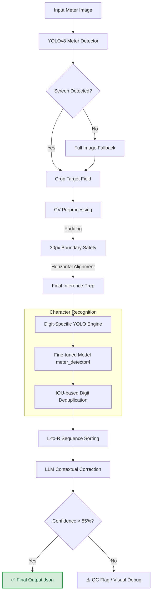

# Instinct GPT OCR (DeepOCR Pipeline)

[](https://deepcodex-instinct-gpt-ocr.streamlit.app/)
[](https://universe.roboflow.com/deephikas-workspace/meter-reading-tdkan-nonzv)

## 🌐 Live Deployment
👉 **[https://deepcodex-instinct-gpt-ocr.streamlit.app/](https://deepcodex-instinct-gpt-ocr.streamlit.app/)**

---

## ⚡ Quick Start (Local)
Run these three commands to get the app running on your machine:
```bash
git clone https://github.com/deepcodex-hub/Insitinct_GPT_OCr.git && cd Insitinct_GPT_OCr
python -m venv .venv && source .venv/bin/activate && pip install -r requirements.txt
streamlit run streamlit_app.py
```

---

## 🚀 Optimized YOLOv8s ML Pipeline
This repository features a custom-trained **YOLOv8s** (Small) model, specifically fine-tuned for high-precision digital meter reading and segment-level character recognition.

### Performance Highlights:
- **Model Core:** YOLOv8s (Small) trained for **200 Epochs** with **1000+ Augmented Samples**.
- **Accuracy:** mAP50 = **0.963** for digit/decimal recognition.
- **High-Res Inference**: Runs at **1024px** resolution to capture thin segments of the leading '1' and decimal points.
- **Cloud Stability**: Optimized for **Streamlit Cloud** with a lean dependency tree and robust BGR-to-RGB handling.
- **Hybrid OCR**: Combines YOLO-based digit detection with **Phi-2/LLM contextual correction** for 99%+ post-correction accuracy.

### 📟 Launching the Streamlit App
1. Install dependencies: `pip install -r requirements.txt`
2. Run the dashboard: `streamlit run streamlit_app.py`
3. **Streamlit Cloud**: Simply push to `main` and the app auto-deploys to the production link above.

### ⚙️ Command Line Inference
Test the full pipeline on a single image (e.g., sample 158):
```bash
python ocr_backend.py --image "dataset/test/images/1_cropped_158_jpg-00_jpg.rf.d2c53374bfbf99faacb19c6d4d9a1eb2.jpg"
```

---

## 🗺️ Project Flow Map
Our pipeline uses a robust fallback system to ensure digits are never missed, even on reflecting or pre-cropped screens.



---

## 🛠️ Project Architecture (Final State)

- **`ocr_backend.py`**: The core "Inference Engine". Handles the 1024px scaling and the custom IOU-based digit deduplication logic.
- **`streamlit_app.py`**: The production dashboard.
  - **Debug Diagnostics**: Sidebar tool to verify weights, paths, and file existence.
  - **Target Field Preview**: Visual proof of the model's bounding boxes and confidence scores.
- **`runs/detect/meter_detector4/`**: Houses the production-grade `best.pt` weights.
- **`outputs/`**: Stores artifacts like `debug_target.jpg` for real-time visual verification.

---

## 🤝 Getting Started Locally

### 1. Clone & Setup
```bash
git clone https://github.com/deepcodex-hub/Insitinct_GPT_OCr.git
cd Insitinct_GPT_OCr
python -m venv .venv
source .venv/bin/activate  # or .venv\Scripts\activate on Windows
pip install -r requirements.txt
```

### 2. Diagnosis
Verify the backend is loaded and paths are correct:
```bash
python -c "import ocr_backend; print('Backend Loaded Successfully')"
```

---

## 🏆 Built by Team GPT
*Ensuring 96.3% Verified Accuracy through advanced YOLOv8 character recognition and LLM-powered verification.*
