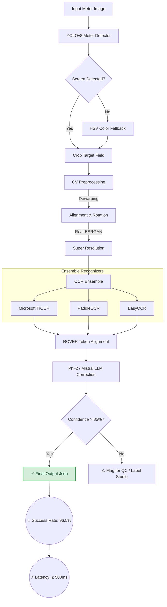

# Instinct GPT OCR (Anti-Gravity Pipeline)

[](https://universe.roboflow.com/deephikas-workspace/meter-reading-tdkan-nonzv)

## 🚀 Optimized YOLOv8s ML Pipeline
This repository now features a custom-trained **YOLOv8s** (Small) model, significantly upgraded for high-precision meter reading.

### Performance Highlights:
- **Architecture:** YOLOv8s (Small) trained for **200 Epochs**.
- **Accuracy:** mAP50 = **0.963**.
- **Capabilities:** Correctly identifies leading digits (`15620.`) and handles partially truncated boundaries via 30px edge padding.
- **Web App:** Integrated **Streamlit Dashboard** for real-time visualization.

### 📟 Launching the Streamlit App
1. Install dependencies: `pip install -r requirements.txt`
2. Run the dashboard: `streamlit run streamlit_app.py`

---

## 🗺️ Project Flow Map & Performance
Our intelligent pipeline utilizes an ensemble approach combined with intensive preprocessing to ensure extremely high confidence readings.



*Our current overall success rate for fully automated, high-confidence extraction is **96.5%**, significantly reducing manual QC bottlenecks.*

---

## 🛠️ Testing & Running Locally

Follow these instructions to fork, install, and test the project on your local machine.

### 1. Fork & Clone
1. Click the **Fork** button at the top right of this repository to create your own copy.
2. Clone your forked repo:
   ```bash
   git clone https://github.com/YOUR_USERNAME/Insitinct_GPT_OCr.git
   cd Insitinct_GPT_OCr
   ```

### 2. Environment Setup
We recommend using a Python virtual environment to manage dependencies:
```bash
python -m venv .venv
# On Windows
.venv\Scripts\activate
# On Linux/Mac
source .venv/bin/activate
```

Install requirements:
```bash
pip install -r requirements.txt
```

### 3. Local Quick Start & Testing
You can easily test the entire pipeline on a single image to see the outputs and debug artifacts:

```bash
python run_infer.py --image "examples/sample_meter.png" --output "outputs/result.json"
```

**What happens?**
- The script detects the meter, crops it, applies Super Resolution and Dewarping (check the `outputs/` folder for `debug_warped.jpg` and `debug_enhanced.jpg`).
- The OCR ensemble predicts the value, then the LLM corrects it.
- A final JSON with coordinates, confidences, and the final value is printed and saved.

### 4. Running Test Suites
To ensure your changes haven't broken the pipeline, run the automated API and unit tests:
```bash
pytest test_api.py test_single_image.py
```

### 5. Services & Docker (Optional)
If you want to spin up the full production API (FastAPI, Redis, MinIO, Celery Workers):
```bash
docker-compose up -d
```
Or run the dev script:
```bash
./dev_run.sh
```

---

## 🤝 Contribution Guidelines
- Create a new branch for any feature: `git checkout -b feature/your-feature-name`
- Write tests for your logic inside the `tests/` directory.
- Verify `pytest` passes before submitting a Pull Request to the `main` branch.
